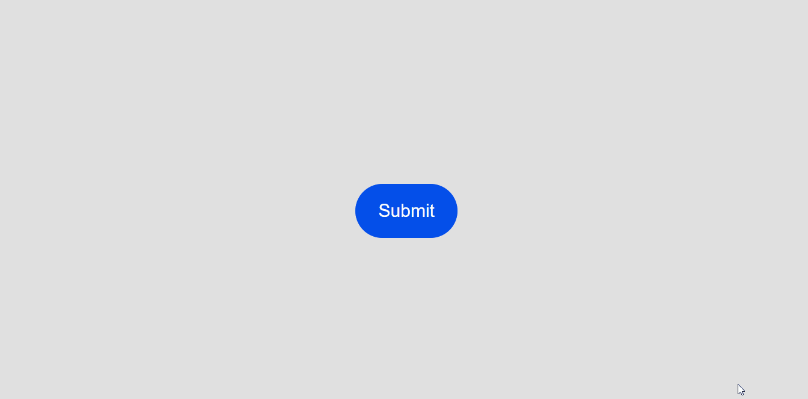

# 🎨 UI Animations


A collection of responsive, reusable, and easy-to-use user interface animations for any project

---

## 🚀 Preview


---

## ✨ Features

- 🧼 Clean, optimized, and organized code
- 🎨 Smooth and modern animations
- 🧩 Reusable components
- ⚡ Easy integration
- 📱 Fully responsive design

---

## 🎨 Animations

### 🔘 Download Button

- Button with progressive download animation
- Technologies: HTML, CSS, JavaScript, GSAP
- Demo: https://jh-ui-animations.vercel.app/animations/download-button

### 🔘 Loading Grid

- 4x4 Grid Infinite Loading Animation
- Technologies: HTML, CSS, JavaScript, GSAP
- Demo: https://jh-ui-animations.vercel.app/animations/loading-grid

### 🔘 Login Interface

- Form with bright radial animation
- Technologies: HTML, CSS, JavaScript
- Demo: https://jh-ui-animations.vercel.app/animations/login-interface

### 🔘 Navbar Icons

- Navbar with animated hover icons
- Technologies: HTML, CSS, JavaScript
- Demo: https://jh-ui-animations.vercel.app/animations/navbar-icons

### 🔘 Neon Button

- Button with neon-style animation
- Technologies: HTML, CSS
- Demo: https://jh-ui-animations.vercel.app/animations/neon-button

### 🔘 Send Button

- Button with progressive send animation
- Technologies: HTML, CSS, JavaScript
- Demo: https://jh-ui-animations.vercel.app/animations/send-button

---

## 🌐 Live Demo

👉 https://jh-ui-animations.vercel.app

---

## 📌 Description

This project is a collection of modern UI animations designed to enhance user experience in web applications.

Each animation is built with performance and reusability in mind, making it easy to integrate into real-world projects.

---

## 🛠️ Technologies

- HTML5
- CSS3
- Javascript
- GSAP

---

## ▶️ Usage

1. Navigate to the desired animation
2. Copy the HTML, CSS, and Javascript files
3. Paste them into your project
4. Install dependencies if required (e.g., GSAP)
5. Customize styles as needed

---

## ⚙️ Installation

Clone the repository:

```bash
git clone https://github.com/hern-andez/jh-ui-animations.git
cd jh-ui-animations
npm install
npm run dev
```

Or directly copy the animation you need.

---

## 📁 Structure

```
jh-ui-animations/
├── animations/
│   ├── download-button/
│   ├── loading-grid/
│   ├── login-interface/
│   ├── navbar-icons/
│   ├── neon-button/
│   ├── send-button/
│
├── src/
│   ├── index.css
│   ├── script.js
│   ├── projects.json
│
├── index.html
├── README.md
├── .gitignore
├── package.json
├── vite.config.js
├── License
```

---

## 💻 Example

This is a simplified version of the animation for demonstration purposes.
For the full implementation, check:
👉 animations/send-button

### Send Button Animation

#### HTML

```html
<button class="submitBtn">
  <span class="btn__text" style="font-size: 30px">Submit</span>
  <span class="btn__check">✔️</span>
  <div class="btn__load"></div>
</button>
```

#### CSS

```css
.submitBtn {
  background-color: #044fea;
  width: 170px;
  height: 90px;
  border-radius: 100px;
  display: grid;
  place-content: center;
  position: relative;
}

.submitBtn .btn__check {
  background-color: #eae6e6;
  color: transparent;
  font-size: 20px;
  height: 0px;
  width: 0px;
  border-radius: 100px;
  z-index: 0;
  display: grid;
  place-content: center;
  display: none;
  position: relative;
}

.submitBtn .btn__load {
  --progress: 0%;
  background: conic-gradient(#044fea var(--progress), #98989888 0%);
  width: 100%;
  height: 100%;
  border-radius: 100px;
  position: absolute;
  z-index: -10;
}
```

#### Javascript & GSAP

```js
import GSAP from "GSAP";

const btn = document.querySelector(".submitBtn");
const btnText = document.querySelector(".btn__text");
const loader = document.querySelector(".btn__load");
const checkIcon = document.querySelector(".btn__check");
let isAnimating = false;

const btnAnimationTl = GSAP.timeline({ paused: true });
btnAnimationTl.to(btn, {
  duration: 0.3,
  width: "92px",
  backgroundColor: "#98989888",
  onComplete: () => circleProcessTl.play("expand"),
  onReverseComplete: () => animate(),
});

const circleProcessTl = GSAP.timeline({ paused: true });
circleProcessTl
  .addLabel("expand")
  .to(checkIcon, {
    duration: 0.25,
    width: "60px",
    height: "60px",
    zIndex: 10,
    display: "grid",
    onComplete: () => processTl.restart(),
  })
  .addPause("success")
  .to(checkIcon, {
    duration: 0.25,
    backgroundColor: "#044fea",
    onComplete: () => checkTl.restart(),
  });

const checkTl = GSAP.timeline({ paused: true });
checkTl
  .to(checkIcon, {
    duration: 0.5,
    color: "inherit",
    ease: "none",
    onReverseComplete: () => {
      circleProcessTl.revert();
      processTl.revert();
      btnAnimationTl.reverse();
    },
  })
  .to({}, { delay: 1, onComplete: () => checkTl.reverse() });

let loadPercentage = { value: 0 };
const processTl = GSAP.timeline({ paused: true });
processTl.to(loadPercentage, {
  duration: 2.1,
  ease: "none",
  value: 100,
  onUpdate: () => loader.style.setProperty("--progress", `${loadPercentage.value}%`),
  onComplete: () => circleProcessTl.play("success"),
});

function animate() {
  isAnimating = !isAnimating;

  btnText.style.display = isAnimating ? "none" : "inline";
  loader.style.zIndex = isAnimating ? 0 : -10;
  loader.style.setProperty("--progress", "0%");
}

btn.addEventListener("click", () => {
  if (isAnimating) return;

  animate();
  btnAnimationTl.restart();
});
```

---



---

## 🎯 Objective

The objective of this project is to practice and demonstrate user interface animation skills, focusing on clean code, creativity, and usability in real-world environments.

---

## 👤 Author

Created by Jesus Hernandez 🚀
Growing Front End Developer

## 📄 Licence

This project is under the MIT license.
