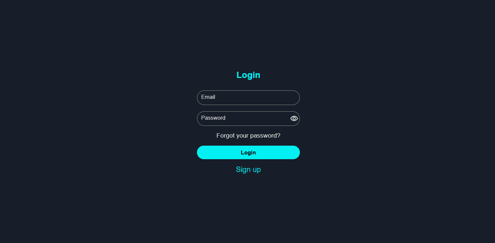

structure, example, preview vizual
Como usar si al copear la animacion desde github se debe instalar gsap y vite

# 🎨 UI Animations


A collection of responsive, reusable, and easy-to-use user interface animations for any project

## ✨ Characteristics

- 🧼 Clean, optimized, and organized code
- 🎨 Smooth and modern animations
- 🧩 Reusable components
- ⚡ Easy integration
- 📱 Responsive design

## 🚀 Preview vizual



## 🎨 Animations

### 🔘 Download Button

- Button with progressive download animation
- Technologies: HTML, CSS, JavaScript, Gsap
- Demo: https://jh-ui-animations.vercel.app/animations/download-button

### 🔘 Loading Grid

- 4x4 Grid Infinite Loading Animation
- Technologies: HTML, CSS, JavaScript, Gsap
- Demo: https://jh-ui-animations.vercel.app/animations/loading-grid

### 🔘 Login Interface

- Form with bright radial animation
- Technologies: HTML, CSS, JavaScript
- Demo: https://jh-ui-animations.vercel.app/animations/login-interface

### 🔘 Navbar Icons

- Navbar with animated hover icons
- Technologies: HTML, CSS, JavaScript
- Demo: https://jh-ui-animations.vercel.app/animations/navbar-icons

### 🔘 Neon Button

- Button with neon-style animation
- Technologies: HTML, CSS
- Demo: https://jh-ui-animations.vercel.app/animations/neon-button

### 🔘 Send Button

- Button with progressive send animation
- Technologies: HTML, CSS, JavaScript
- Demo: https://jh-ui-animations.vercel.app/animations/send-button

## 🌐 Live Demo

👉 https://jh-ui-animations.vercel.app

## 📌 Description

This project is a collection of modern UI animations designed to enhance user experience in web applications.

Each animation is built with performance and reusability in mind, making it easy to integrate into real-world projects.

## 🧩 Features

- ⚡ Lightweight and performant animations
- 🎯 Focused on UI/UX improvement
- 🧩 Modular and reusable structure
- 🔥 Built with modern frontend practices

## 🛠️ Technologies

- HTML5
- CSS3
- JS
- GSAP

## ▶️ Usage

1. Navigate to the desired animation
2. Copy the HTML, CSS, and JS files
3. Paste them into your project
4. Customize the styles if needed

## ⚙️ Installation

Clone the repository:

```bash
git clone https://github.com/hern-andez/jh-ui-animations.git
cd jh-ui-animations
npm i
```

Or directly copy the animation you need.

---

## 📁 Structure

```
jh-ui-animations/
├── assets/
│ ├── preview.gif
│ ├──
│
├── animations/
│ ├── download-button/
│ ├── loading-grid/
│ ├── login-interface/
│ ├── navbar-icons/
│ ├── neon-button/
│ ├── send-button/
│
├── index.html
├── README.md
├── .gitignore
├── package.json
├── vite.config.js
```

---

## 💻 Example

---

## 🎯 Objective

The objective of this project is to practice and demonstrate user interface animation skills, focusing on clean code, creativity, and usability in real-world environments.

---

## 👤 Author

Created by Jesus Hernandez 🚀
Growing Front End Developer

## 📄 Licence

This project is under the MIT license.
